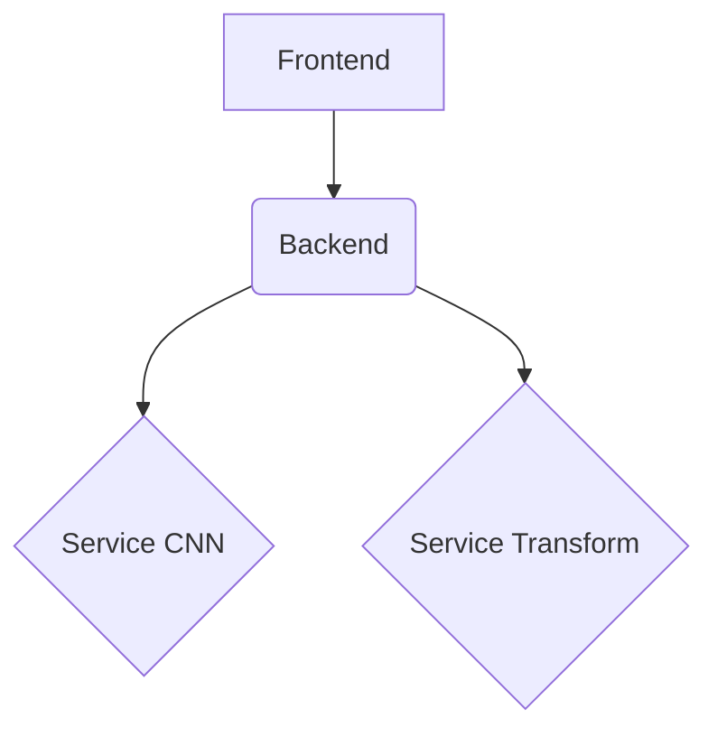

# System Architecture Diagram

This document outlines the architecture of the `tesis_project`, detailing the interactions between its frontend, backend, and supporting services.

## High-Level Architecture

The `tesis_project` is structured around a client-server model, with a **Frontend** (file:frontend) interacting with a **Backend** (file:backend). The backend, in turn, leverages several specialized **Services** (file:services), primarily related to image analysis and similarity.

## Frontend (file:frontend)

The **Frontend** is a web application responsible for user interaction, image uploads, and displaying analysis results. It's built with React/TypeScript and uses a component-based structure.

### Key Components:

*   **`src/app/router.tsx`**: Manages the routing within the single-page application, directing users to different views like analysis or home.
*   **`src/features/analyzer`**: This is the core feature module for image analysis.
    *   **`api/client.ts` and `api/upload.ts`**: Handle communication with the backend API, specifically for uploading images and receiving analysis results.
    *   **`components/UploadArea.tsx`**: Provides the user interface for uploading images.
    *   **`components/ResultsCard.tsx`**: Displays the results of the image analysis.
    *   **`hooks/useUploadHandler.ts`**: Contains the logic for handling the image upload process and interacting with the backend.
*   **`src/pages`**: Contains the main page components, such as `Analysis.tsx` and `Index.tsx`.

### Frontend-Backend Connection:

The frontend communicates with the backend primarily through HTTP requests, facilitated by the `src/features/analyzer/api` module. It sends image data for analysis and receives structured data back for display.

## Backend (file:backend)

The **Backend** is a Django-based application that serves as the central API for the system. It orchestrates image processing, interacts with external services, and manages data.

### Key Modules:

*   **`api/application`**: Contains the application-level use cases, such as `upload_batch_usecase.py` and `upload_image_usecase.py`, which define the business logic for handling image uploads.
    *   **`upload_batch_usecase.py`** (file:backend/api/application/upload_batch_usecase.py) (node:UploadBatchUseCase_UBUC): This use case handles the upload and processing of multiple image files in a batch. It iterates through image files, generates embeddings, uploads to Cloudinary, generates unique IDs, and stores embeddings. It heavily relies on services from `api.infrastructure.services` for external interactions.
    *   **`upload_image_usecase.py`** (file:backend/api/application/upload_image_usecase.py) (node:UploadImageUseCase_UIUC): This use case handles the upload and processing of a single image file, including finding similar images. It generates embeddings, uploads to Cloudinary, generates IDs, searches for similar images, calculates processing time, and stores analyzed image and similarity results in the database. It also uses services from `api.infrastructure.services` and interacts with `api.domain.models.ImageAnalyzed` and `api.domain.models.SimilarityResult`.
*   **`api/domain/models`**: Defines the data models used throughout the API, such as `image_analyzed.py` and `similarity_result.py`.
*   **`api/infrastructure/services`**: Provides interfaces and implementations for external services.
    *   **`cloudinary_service.py`** (file:api/infrastructure/services/cloudinary_service.py) (node:CloudinaryService_CS1): Handles the uploading of image files to Cloudinary for external storage.
    *   **`embedding_service.py`** (file:api/infrastructure/services/embedding_service.py) (node:EmbeddingService_ES2): Generates numerical embeddings (vector representations) for images using an external TensorFlow Serving model (EfficientNet). This is crucial for image similarity.
    *   **`image_service.py`** (file:api/infrastructure/services/image_service.py) (node:ImageService_IS3): Provides utility functions for image-related operations, specifically generating unique IDs for images.
    *   **`pinecone_service.py`** (file:api/infrastructure/services/pinecone_service.py) (node:PineconeService_PS4): Manages interactions with the Pinecone vector database, including storing image embeddings and performing similarity searches.
*   **`api/presentation`**: Contains the API views (`upload_batch_view.py`, `upload_image_view.py`) that expose the backend functionalities to the frontend.
*   **`backend/urls.py`**: Defines the URL routing for the backend API endpoints.

### Backend-Service Interactions:

The backend interacts with several specialized services to perform its tasks:

*   **Feature Extractor Service (file:feature-extractor-service)**: The `embedding_service.py` in the backend's infrastructure likely calls this service to obtain image embeddings. This service appears to be responsible for generating numerical representations (embeddings) of images using pre-trained models (e.g., EfficientNet b0, b2).
*   **Service CNN (file:services/service-cnn)**: This service seems to be responsible for CNN-based image processing, potentially using `clip_vision.onnx`. The backend might call this service for specific image analysis tasks.
*   **Service Transform (file:services/service-transform)**: This service, with its `transformation_core.py`, suggests it handles image transformations or pre-processing. The backend might utilize this service before generating embeddings or performing other analyses.

## Feature Extractor Service (file:feature-extractor-service)

This service is dedicated to extracting features (embeddings) from images using EfficientNet models. It acts as a service that takes an image as input and outputs a numerical representation of that image.

### Key Components:

*   **`export_model.py` (file:feature-extractor-service/export_model.py):** This script is crucial for preparing and exporting the EfficientNet models for deployment. It defines a functional Keras model that takes an image input, preprocesses it, and then passes it through the EfficientNet base model to obtain the embedding. The model is then exported in the TensorFlow SavedModel format.
*   **Different EfficientNet Models (b0, b2):** The service supports different scales of the EfficientNet architecture, specifically **EfficientNetB0** (file:feature-extractor-service/b0/export_model.py) and **EfficientNetB2** (file:feature-extractor-service/b2/export_model.py). These models are likely fine-tuned (indicated by "phase3") and are used to generate the image embeddings.
*   **`Dockerfile`**: Defines the environment for deploying this service.

### Role in the System:

The **Feature Extractor Service** is a crucial component for the image similarity functionality. It takes an image as input and returns a high-dimensional vector (embedding) that represents the image's content. These embeddings are then used by the backend (via `pinecone_service.py`) for similarity searches.

## Service CNN (file:services/service-cnn)

This service appears to house a microservice dedicated to image processing, specifically for generating image embeddings using a CLIP model.

### Key Components:

*   **`app/main.py`**: The main application file for this service.
*   **`clip_vision.onnx`**: This is the core of the image processing functionality. It's an ONNX format file representing the **vision encoder component of a CLIP model**. It takes an image as input and produces a high-dimensional vector (the embedding) that represents the image's content semantically.

### Role in the System:

The **Service CNN** acts as an image embedding microservice, leveraging the `clip_vision.onnx` model to transform raw image data into numerical embeddings, which are crucial for various downstream AI tasks like image similarity search or classification. It also integrates with Cloudinary for file storage.

## Service Transform (file:services/service-transform)

This service is designed to perform various image processing operations, applying specified transformations to image data.

### Key Components:

*   **`transformation_core.py` (file:services/service-transform/app/transformation_core.py):** This is the central module responsible for executing the actual image transformation logic. It contains functions for various transformations and handles image reading, writing, and potentially uploading.
*   **Types of Transformations:** The service can perform:
    *   **Contrast adjustment:** `apply_contrast_enhancement` (node:ContrastEnhancement_TC1)
    *   **Texture analysis/manipulation:** `apply_texture_direction` (node:TextureDirection_TC2)
    *   **Color mapping/remapping:** `apply_color_distribution_map` (node:ColorDistributionMap_TC3)
    *   **HSV channel manipulation:** `apply_hsv_channels` (node:HSVChannels_TC4)
*   **`app/utils_transformations.py`**: Provides utility functions for image transformations.

### Role in the System:

The **Service Transform** ensures that images are in the correct format or have undergone necessary pre-processing steps before being fed into other services (e.g., Feature Extractor Service or Service CNN) or stored. This could include resizing, cropping, normalization, or other image manipulation tasks. It also integrates with Cloudinary for image storage.

## Data Flow Example: Image Upload and Analysis

1.  **User Uploads Image**: The user interacts with the **Frontend** (file:frontend) and uploads an image via the `UploadArea.tsx` component.
2.  **Frontend Sends Request**: The `useUploadHandler.ts` hook and `api/upload.ts` send the image data to the **Backend** (file:backend) via an HTTP POST request to an endpoint handled by `upload_image_view.py`.
3.  **Backend Processes Request**:
    *   The `upload_image_usecase.py` (node:UploadImageUseCase_UIUC) in the backend's `application` layer is invoked.
    *   The backend might use `image_service.py` (node:ImageService_IS3) and potentially call the **Service Transform** (file:services/service-transform) for any necessary image pre-processing (e.g., using `transformation_core.py`).
    *   The `embedding_service.py` (node:EmbeddingService_ES2) then sends the image to the **Feature Extractor Service** (file:feature-extractor-service) to obtain its embedding.
    *   The backend might also call the **Service CNN** (file:services/service-cnn) for additional image analysis using `clip_vision.onnx`.
    *   The `pinecone_service.py` (node:PineconeService_PS4) uses the generated embedding to perform a similarity search in the Pinecone vector database.
    *   The backend constructs a `SimilarityResult` (file:backend/api/domain/models/similarity_result.py) and `ImageAnalyzed` (file:backend/api/domain/models/image_analyzed.py) object.
4.  **Backend Sends Response**: The backend serializes the results using `similarity_result_serializer.py` and `image_analyzed_serializer.py` and sends them back to the frontend.
5.  **Frontend Displays Results**: The `ResultsCard.tsx` component in the frontend receives the analysis results and displays them to the user.

### Implementation Steps

1. **Understanding the High-Level Architecture**
   The `tesis_project` operates on a client-server model, featuring a `Frontend` for user interaction and a `Backend` that processes requests. The `Backend` integrates with several specialized `Services`, including a `Feature Extractor Service`, `Service CNN`, and `Service Transform`, to handle image analysis and similarity tasks.

2. **Exploring the Frontend Component**
   The `Frontend` is a web application built with React/TypeScript, designed for user interaction, image uploads, and displaying analysis results. It manages routing with `router.tsx` and includes a core `analyzer` module. This module contains `api/client.ts` and `api/upload.ts` for backend communication, `UploadArea.tsx` for image uploads, `ResultsCard.tsx` for displaying results, and `useUploadHandler.ts` for upload logic. The frontend communicates with the backend via HTTP requests.

3. **Delving into the Backend Component**
   The `Backend` is a Django-based application serving as the central API. It orchestrates image processing and interacts with external services. Key modules include `api/application` for use cases like `upload_batch_usecase.py` and `upload_image_usecase.py`, which define business logic for image handling. `api/domain/models` defines data models, while `api/infrastructure/services` provides interfaces for external services such as `cloudinary_service.py` for storage, `embedding_service.py` for generating image embeddings, `image_service.py` for image utilities, and `pinecone_service.py` for similarity searches. `api/presentation` contains API views, and `backend/urls.py` defines routing.

4. **Understanding the Feature Extractor Service**
   The `Feature Extractor Service` is dedicated to generating numerical representations (embeddings) of images using EfficientNet models. It takes an image as input and outputs a high-dimensional vector that represents the image's content. This service is crucial for image similarity functionality, with `export_model.py` handling model preparation and export. It supports different EfficientNet models like `EfficientNetB0` and `EfficientNetB2`.

5. **Exploring the Service CNN**
   The `Service CNN` is a microservice focused on image processing, specifically for generating image embeddings using a CLIP model. Its core component is `clip_vision.onnx`, an ONNX file representing the vision encoder of a CLIP model, which transforms raw image data into numerical embeddings. This service is vital for tasks like image similarity search and integrates with Cloudinary for file storage.

6. **Understanding the Service Transform**
   The `Service Transform` is designed to perform various image processing operations and apply transformations to image data. Its central module, `transformation_core.py`, handles image reading, writing, and uploading, and includes functions for operations like contrast adjustment, texture analysis, color mapping, and HSV channel manipulation. This service ensures images are correctly formatted or pre-processed before being used by other services.

7. **Understanding the Data Flow: Image Upload and Analysis**
   The image upload and analysis process begins when a user uploads an image via the `Frontend`'s `UploadArea.tsx`. The `Frontend` then sends this image data to the `Backend` via an HTTP POST request. The `Backend` processes this request using `upload_image_usecase.py`, potentially pre-processing the image with `Service Transform`. It then sends the image to the `Feature Extractor Service` to obtain its embedding and may also use `Service CNN` for additional analysis. The `Backend` performs a similarity search using `pinecone_service.py` and constructs `SimilarityResult` and `ImageAnalyzed` objects. Finally, the `Backend` sends the results back to the `Frontend`, which displays them using `ResultsCard.tsx`.

