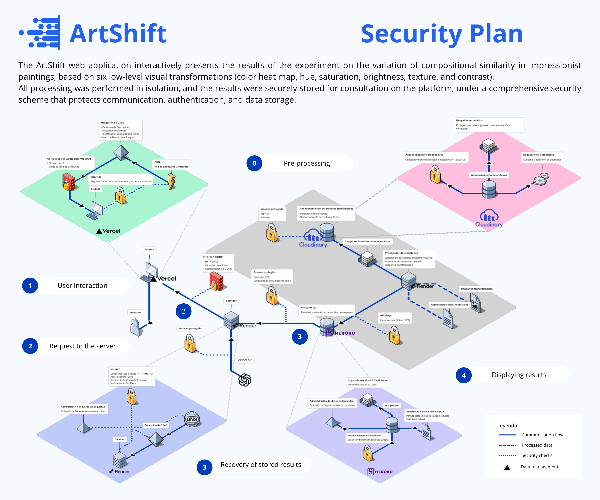

# Artshift

## Overview
This project showcases an experimental pipeline for analyzing and comparing Impressionist-style paintings using low-level visual features and embedding-based representations.

## Features
- **Compositional similarity**: Measures structural and compositional resemblances between artworks.
- **Low-level visual features**: Extracted from color transformations (color heatmap, hue, saturation, brightness) and texture descriptors (contrast, texture) to emphasize salient characteristics.
- **Embeddings**: Dense vector representations used for efficient similarity search, clustering, and retrieval.

## Workflow


The application's workflow includes:
1. **Apply transformations**: Preprocess images and compute visual transforms.
2. **Feature extraction**: Numerically extract visual and contextual features using deep neural networks.
3. **Similarity scoring**: Compute similarity scores and rankings between artworks.

## Directory Structure
```
└── 📁.
    └── 📁backend                # application server: endpoints, business logic, and configuration
        └── 📁api               # backend API handlers
        └── 📁backend           # backend core modules
        └── 📁tests             # unit and integration tests
    └── 📁frontend
        └── 📁src
            └── 📁components
            └── 📁pages
            └── 📁services
    └── 📁resources             # static assets (images, diagrams, docs)
    └── 📁services
        └── 📁service-transform # image transformation service
        └── 📁service-cnn       # feature-extraction service using neural networks
    └── 📁similarity_processor
        └── 📁api
        └── 📁similarity_processor
```

## Data security diagram

