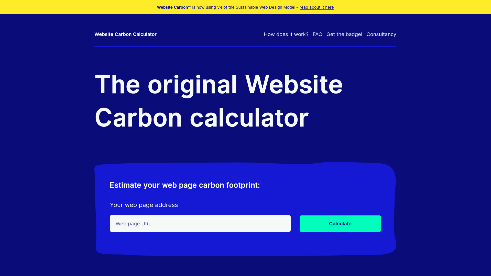

# Sostenibilidad – Proyecto ArtShift

El presente documento técnico describe el enfoque de sostenibilidad adoptado en el proyecto **ArtShift** y su ecosistema tecnológico (frontend React-TypeScript, backend Django-Python, base de datos Heroku Postgres). El objetivo es evidenciar cómo cada componente ha sido evaluado, medido y optimizado para minimizar su impacto energético y de emisiones de carbono, en línea con buenas prácticas del desarrollo sostenible, así como con estándares emergentes de software verde.

## Herramientas de medición  
Se realizó una evaluación usando la herramienta [CodeCarbon](https://codecarbon.io/) para el registro automatizado de kWh, kg CO₂e, metadatos de hardware y visualización en dashboard.

<div align="center">


</div>

Adicionalmente, se emplean herramientas de auditoría web ([Website Carbon Calculator](https://www.websitecarbon.com/)) para el frontend.

<div align="center">



</div>

## Ámbitos medidos  
- Componentes de backend: lógica de negocio, orquestación y persistencia.  
- Componentes de frontend: tamaño del bundle, optimización de recursos, performance en Web.  
- Infraestructura de base de datos y hosting: plan [Heroku PostgreSQL Essential](https://elements.heroku.com/addons/heroku-postgresql), optimización de consultas, uso moderado de recursos.  
- Despliegue en nube: medición por ejecución con CodeCarbon, inclusión de variables de entorno (proyecto, experimento) para trazabilidad.

## Componentes del sistema y su evaluación  
### Backend (Django-Python)  
Ubicación de código:  
```
└── 📁backend  
    └── 📁api  
        …  
        └── 📁infrastructure/config/tracker_to_emission.py  
```

<div align="center">


</div>

Se instrumentó con CodeCarbon mediante creación del archivo global `tracker_to_emission.py`, ligada al experimento “ArtShift-Carbon-Eval” y “ArtShift-Carbon-Eval-Cloud”.  
Se midió el consumo promedio por ejecución.  

<div align="center">


</div>

Resultado: consumo medio ~ **0.08 kWh**, emisiones ~ **0.02 kg CO₂e** .  

### Frontend (React-TypeScript)  

Se realizó análisis con WebsiteCarbon, aplicado directamente al enlace de la web para:  
- Evaluar peso total de la página al cargar.  
- Ver el impacto de los recursos cargados (imágenes, scripts, fonts) en la huella de carbono.  
Según auditoría: [artshift.vercel.app](https://artshift.vercel.app) obtuvo una puntuación dentro de rangos aceptables (peso medio, buen tiempo de carga, menor emisiones por visita).  
Se adoptaron prácticas como lazy-load de imágenes, uso de formatos WebP/AVIF, minimización de bundle, caching agresivo.

### Base de datos (Heroku-PostgreSQL Essential)  
Servicio gestionado mediante el plan Essential en Heroku.  
Minimalismo de recursos (una sola instancia, carga moderada) para reducir overhead de infraestructura.  
Optimización de consultas en backend para reducir tiempo de uso de CPU y RAM, lo que indirectamente reduce consumo energético.

<div align="center">


</div>

## Resultados cuantitativos  
- Consumo promedio por ejecución < 0.10 kWh y < 0.05 kg CO₂e - alcanzó valores de **0.08 kWh** y **0.02 kg CO₂e**.  
- Dashboard CodeCarbon muestra: ~0.08 kWh, 0.02 kg CO₂e, ~0.09 días equivalentes de uso de TV.  
- Gráfico de dispersión evidencia variaciones mínimas en ejecuciones repetidas, lo que sugiere alta predictibilidad.  
- Frontend: herramienta WebsiteCarbon indica que las emisiones por visita están por debajo del promedio (~0.36 g CO₂ por vista) según estudio. 

## Buenas prácticas y estrategias de mitigación  
- Minimización del peso de página: optimización de imágenes, reducción de scripts.
- Uso de hosting eficiente y recursos moderados en la nube.  
- Instrumentación de trazas energéticas para identificar “hot-spots” de consumo en backend y servicios.  
- Compromiso de mejora: reducción progresiva del consumo por ejecución, reducción de emisiones por visita, reporte transparente del impacto.


---

