# Sostenibilidad – Proyecto ArtShift

El presente documento técnico describe el enfoque de sostenibilidad adoptado en el proyecto **ArtShift** y su ecosistema tecnológico (frontend React-TypeScript, backend Django-Python, base de datos Heroku Postgres). El objetivo es evidenciar cómo cada componente ha sido evaluado, medido y optimizado para minimizar su impacto energético y de emisiones de carbono, en línea con buenas prácticas del desarrollo sostenible, así como con estándares emergentes de software verde.

## Herramientas de medición

Se realizó una evaluación usando la herramienta [CodeCarbon](https://dashboard.codecarbon.io/public/projects/Xh2lFau8FPZ_Frv7FoHfFX5G4Cj3uwXA6pptubGCGBVqvDu7ojfl7CWXIvQqwnX1Yx41zhGQ38H2b6gWpPgY-g) para el registro automatizado de kWh, kg CO₂e, metadatos de hardware y visualización en dashboard.

<div align="center">

  <a href="https://dashboard.codecarbon.io/public/projects/Xh2lFau8FPZ_Frv7FoHfFX5G4Cj3uwXA6pptubGCGBVqvDu7ojfl7CWXIvQqwnX1Yx41zhGQ38H2b6gWpPgY-g" target="_blank" rel="noopener noreferrer">
    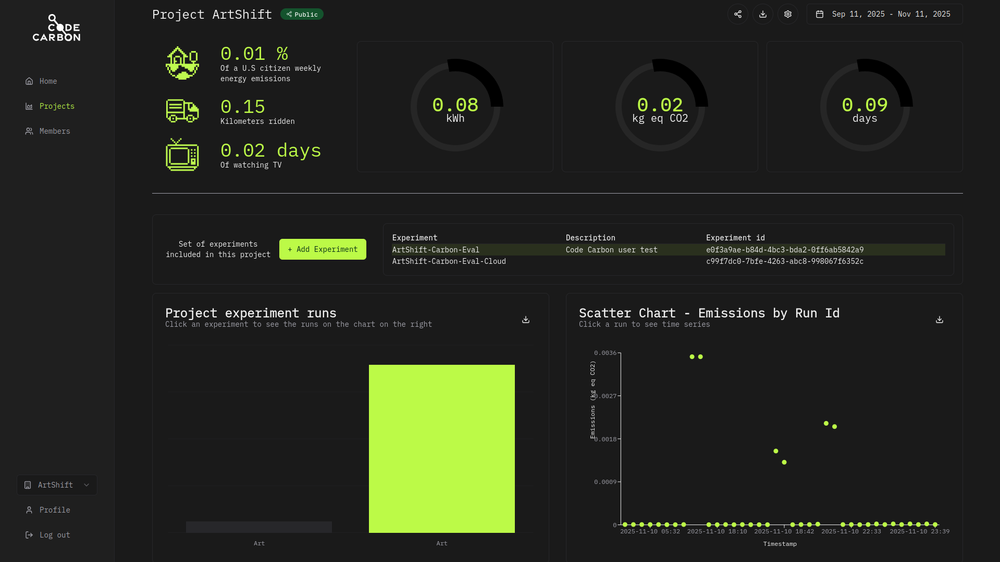
  </a>

  <a href="https://dashboard.codecarbon.io/public/projects/Xh2lFau8FPZ_Frv7FoHfFX5G4Cj3uwXA6pptubGCGBVqvDu7ojfl7CWXIvQqwnX1Yx41zhGQ38H2b6gWpPgY-g" target="_blank" rel="noopener noreferrer">
    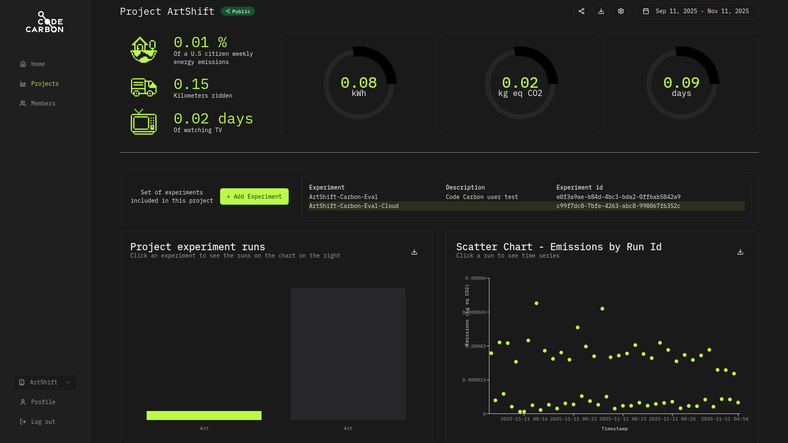
  </a>

</div>

Adicionalmente, se emplean herramientas de auditoría web ([Website Carbon Calculator](https://www.websitecarbon.com/website/artshift-vercel-app/)) para el frontend.

<div align="center">

  <a href="https://www.websitecarbon.com/website/artshift-vercel-app/" target="_blank" rel="noopener noreferrer">
    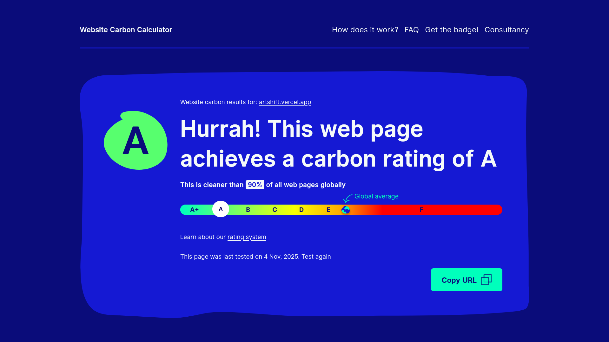
  </a>

</div>

## Ámbitos medidos

- Componentes de backend: lógica de negocio, orquestación y persistencia.
- Componentes de frontend: tamaño del bundle, optimización de recursos, performance en Web.
- Infraestructura de base de datos y hosting: plan [Heroku PostgreSQL Essential](https://elements.heroku.com/addons/heroku-postgresql), optimización de consultas, uso moderado de recursos.
- Despliegue en nube: medición por ejecución con CodeCarbon, inclusión de variables de entorno (proyecto, experimento) para trazabilidad.

## Componentes del sistema y su evaluación

### Backend (Django-Python)

Ubicación de código:

```
└── 📁backend
    └── 📁api
        …
        └── 📁infrastructure/config/tracker_to_emission.py
```

<div align="center">

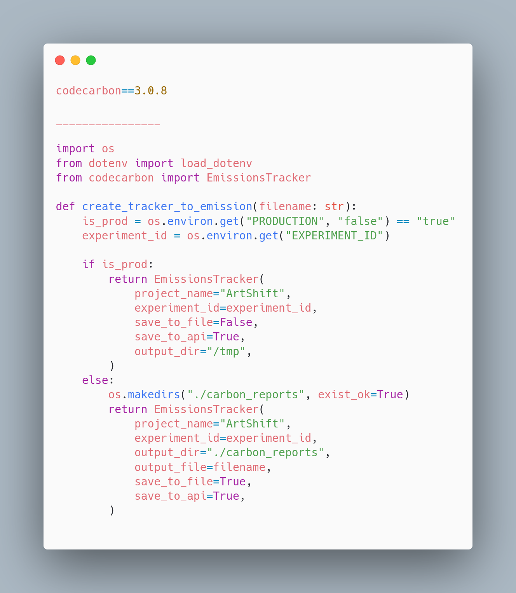

</div>

Se instrumentó con CodeCarbon mediante creación del archivo global `tracker_to_emission.py`, ligada al experimento “ArtShift-Carbon-Eval” y “ArtShift-Carbon-Eval-Cloud”.  
Se midió el consumo promedio por ejecución.

<div align="center">

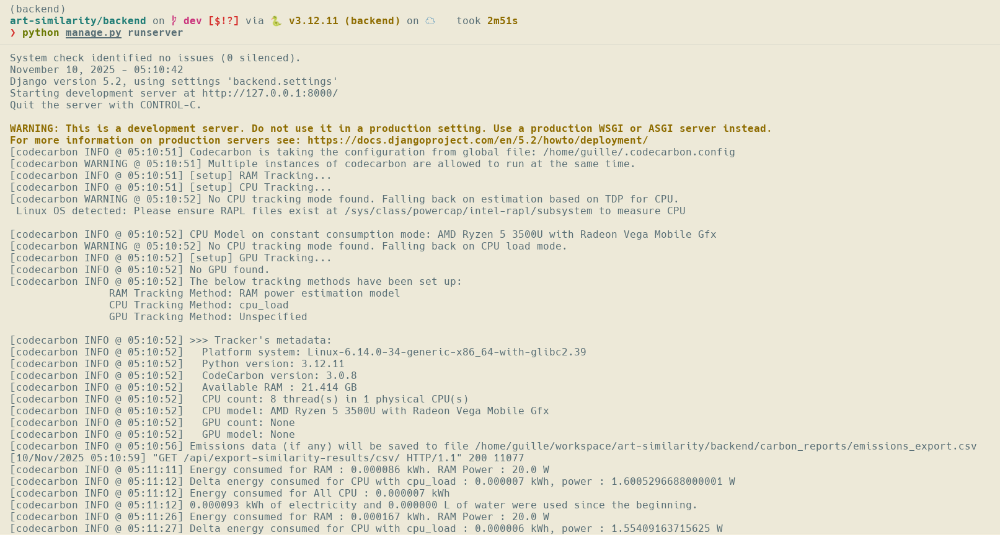

</div>

Resultado: consumo medio ~ **0.08 kWh**, emisiones ~ **0.02 kg CO₂e** .

### Frontend (React-TypeScript)

Se realizó análisis con WebsiteCarbon, aplicado directamente al enlace de la web para:

- Evaluar peso total de la página al cargar.
- Ver el impacto de los recursos cargados (imágenes, scripts, fonts) en la huella de carbono.  
  Según auditoría: [artshift.vercel.app](https://artshift.vercel.app) obtuvo una puntuación dentro de rangos aceptables (peso medio, buen tiempo de carga, menor emisiones por visita).  
  Se adoptaron prácticas como lazy-load de imágenes, uso de formatos WebP/AVIF, minimización de bundle, caching agresivo.

### Base de datos (Heroku-PostgreSQL Essential)

Servicio gestionado mediante el plan Essential en Heroku.  
Minimalismo de recursos (una sola instancia, carga moderada) para reducir overhead de infraestructura.  
Optimización de consultas en backend para reducir tiempo de uso de CPU y RAM, lo que indirectamente reduce consumo energético.

<div align="center">

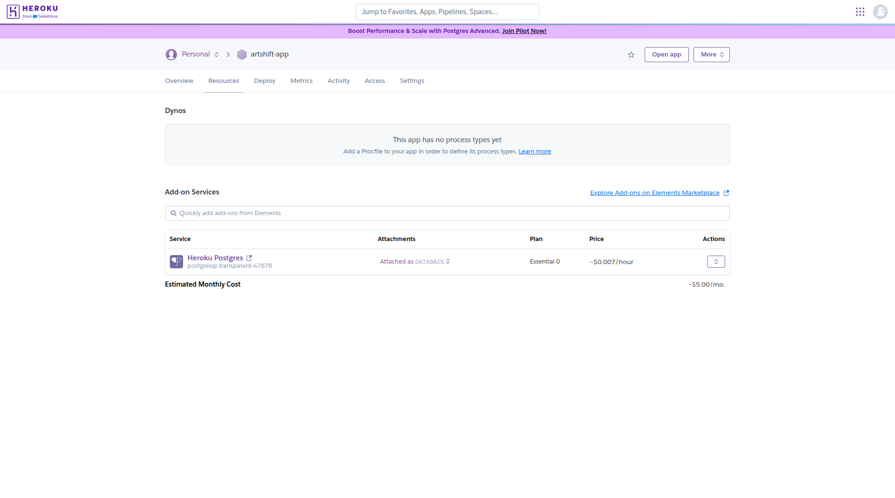

</div>

## Resultados

- Consumo promedio por ejecución < 0.10 kWh y < 0.05 kg CO₂e - alcanzó valores de **0.08 kWh** y **0.02 kg CO₂e**.
- Dashboard CodeCarbon muestra: ~0.08 kWh, 0.02 kg CO₂e, ~0.09 días equivalentes de uso de TV.
- Gráfico de dispersión evidencia variaciones mínimas en ejecuciones repetidas, lo que sugiere alta predictibilidad.
- Frontend: herramienta WebsiteCarbon indica que las emisiones por visita están por debajo del promedio (~0.36 g CO₂ por vista) según estudio.


# Compromiso de Infraestructura y Huella de Carbono

## Vercel: Alojamiento Frontend Sostenible
Como plataforma de alojamiento de nuestro frontend, Vercel implementa una arquitectura serverless que optimiza automáticamente el uso de recursos, reduciendo significativamente el consumo energético durante períodos de inactividad. Su compromiso con la energía renovable asegura que nuestra aplicación web sea servida desde centros de datos que operan con energía 100% renovable. [Más información](https://vercel.com/guides/what-is-vercel-green-energy-policy)

<div align="center">

  <a href="https://vercel.com/guides/what-is-vercel-green-energy-policy" target="_blank" rel="noopener noreferrer">
    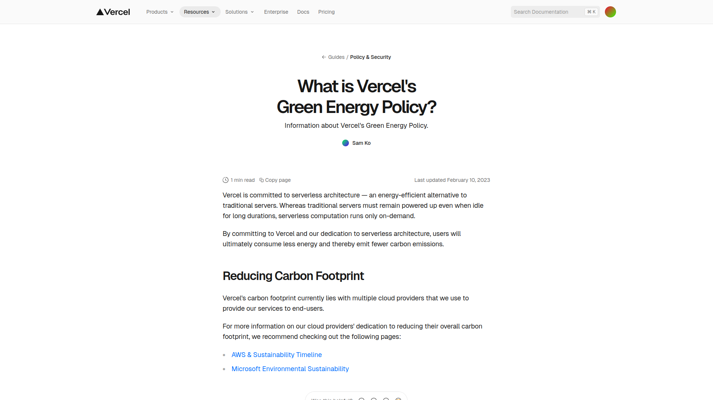
  </a>

  <a href="https://aws.amazon.com/es/sustainability/" target="_blank" rel="noopener noreferrer">
    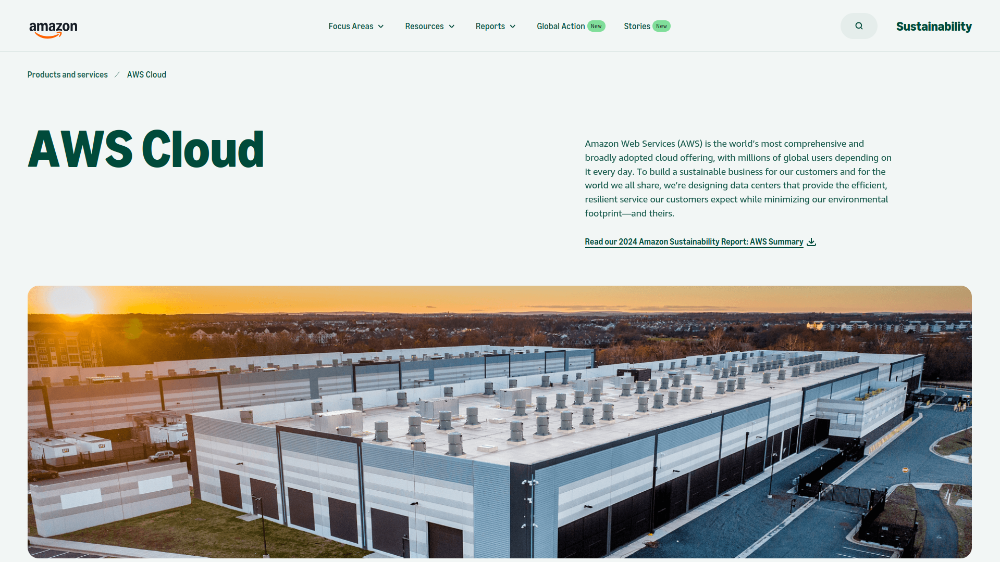
  </a>

  <a href="https://www.microsoft.com/es-es/environment/" target="_blank" rel="noopener noreferrer">
    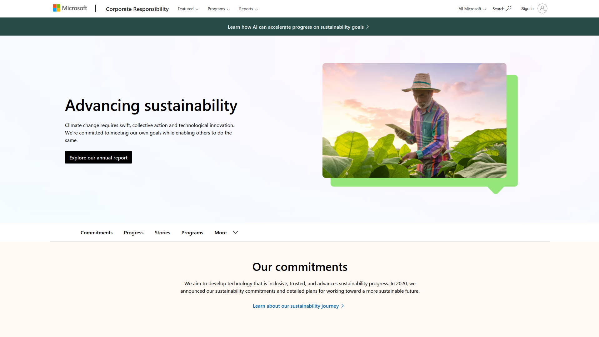
  </a>

</div>

## Heroku: Base de datos con Compromiso Ambiental
Nuestra base de datos se despliega en Heroku, que como parte de Salesforce, ha alcanzado la neutralidad de carbono a nivel global. Esta plataforma gestiona automáticamente la escalabilidad de nuestros recursos, asegurando que solo consumamos la energía estrictamente necesaria. La política de "carbon neutral cloud" de Salesforce garantiza que todas nuestras operaciones en Heroku tengan un impacto neto nulo en emisiones de carbono. [Más información](https://www.salesforce.com/news/press-releases/2021/09/21/salesforce-achieves-net-zero-across-its-full-value-chain/l)

<div align="center">

  <a href="https://www.salesforce.com/news/press-releases/2021/09/21/salesforce-achieves-net-zero-across-its-full-value-chain/l" target="_blank" rel="noopener noreferrer">
    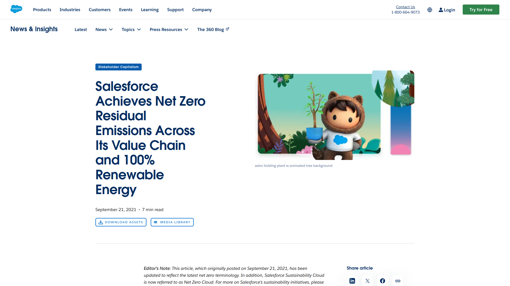
  </a>

</div>


## RenderPlataforma de Aplicaciones Sostenible
Nuestro backend alojado opera sobre infraestructura de Google Cloud Platform (GCP) en la región de Estados Unidos y Amazon Web Services (AWS) en la región europea. Lo que indica que, [hereda los estándares ambientales de ambos proveedores](https://community.render.com/t/does-render-use-green-energy/912):

Google Cloud opera con energía 100 % renovable desde 2017 y mantiene el compromiso de alcanzar energía libre de carbono las 24 h, los 7 días de la semana para 2030, además de una eficiencia energética de centro de datos (PUE) promedio de 1.10, una de las más bajas del sector.

<div align="center">

  <a href="https://cloud.google.com/sustainability?hl=en" target="_blank" rel="noopener noreferrer">
    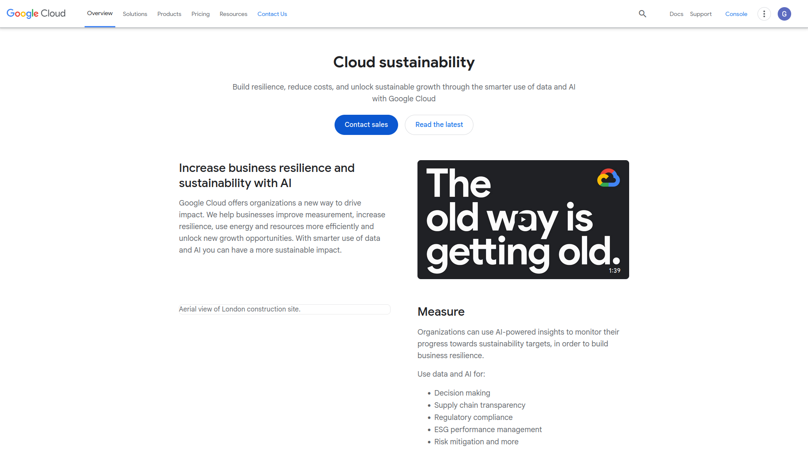
  </a>

</div>

AWS mantiene un plan global de sostenibilidad orientado a operar con energía 100 % renovable para 2025, impulsando una infraestructura de nube de bajo impacto ambiental.

<div align="center">

  <a href="https://sustainability.aboutamazon.com/" target="_blank" rel="noopener noreferrer">
    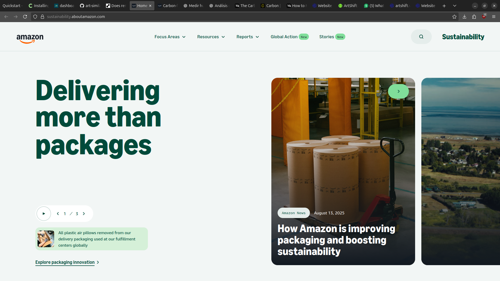
  </a>

  <a href="https://sustainability.aboutamazon.com/climate-solutions/carbon-free-energy" target="_blank" rel="noopener noreferrer">
    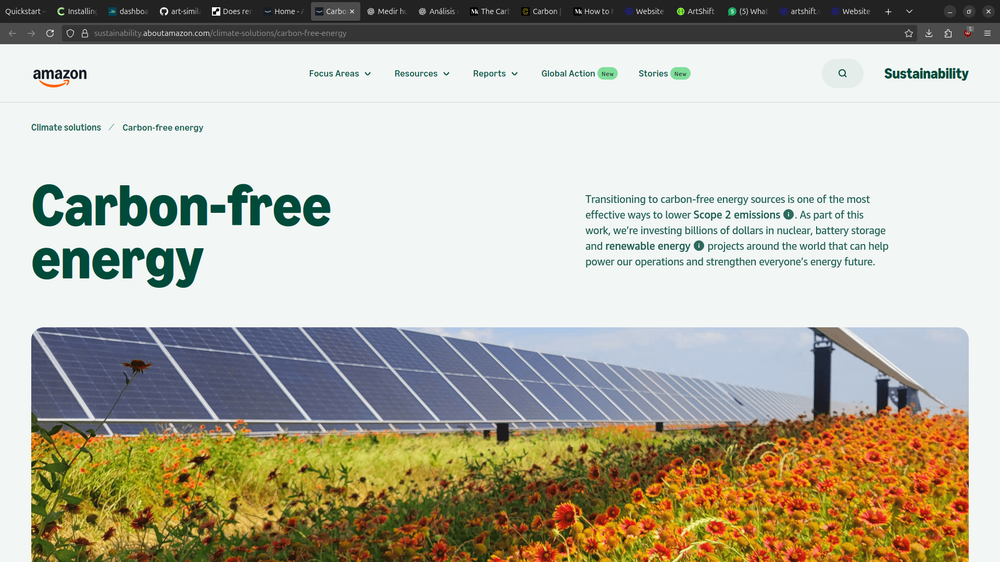
  </a>

</div>


---
